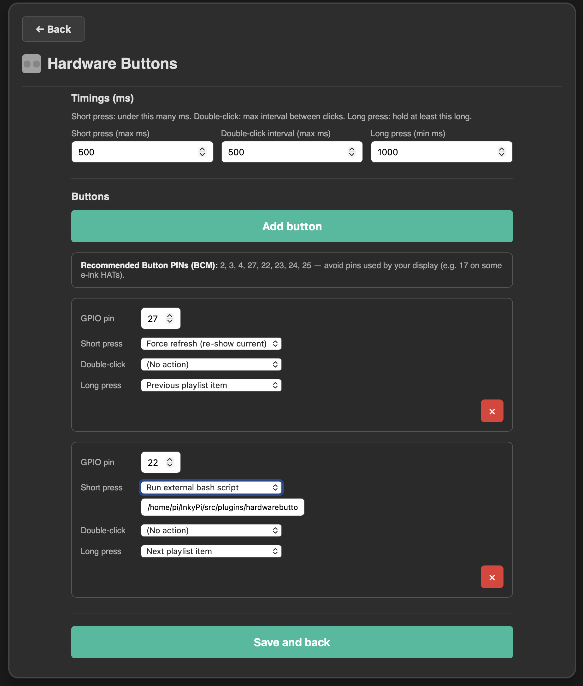

# Hardware Buttons plugin for InkyPi


*Hardware Buttons* is a plugin for [InkyPi](https://github.com/fatihak/InkyPi) that enables you to attach physical buttons to your Raspberry Pi and bind them to InkyPi actions.

## What it does

The Hardware Buttons plugin lets you connect physical pushbuttons to your Raspberry Pi's GPIO pins and configure them to trigger various InkyPi actions. Each button supports **short press**, **double-click**, and **long press** gestures with configurable timings.

### Features

- **Multiple Button Support**: Connect multiple buttons, each with its own GPIO pin
- **Three Gesture Types**: Configure actions for short press, double-click, and long press
- **Configurable Timings**: Adjust timing thresholds for each gesture type
- **Core Actions**: Trigger refresh, force refresh, navigate playlist items
- **System Actions**: Shutdown, reboot, restart InkyPi service
- **Custom Actions**: Run external bash scripts or call URLs/webhooks
- **Extensible**: Other plugins can register additional actions (This is work in progress so probably subject to change, this is why there is no documentation about that yet)
- **Automatic Reload**: Button configuration reloads automatically without restarting InkyPi
- **Graceful Degradation**: Works on development machines without GPIO hardware

### Requirements

- InkyPi must be installed and running
- Core files must be patched (one-time operation, see Installation section below)
- **Raspberry Pi** (e.g. Zero 2 W, 4, 3) with GPIO available
- **Python**: `gpiozero` (see `requirements.txt` in this folder). On a full InkyPi install, GPIO dependencies may already be installed
- **No GPIO on dev machines**: the plugin still loads; button handling is simply disabled when gpiozero or GPIO is unavailable

## Installation

### Step 1: Install the Hardware Buttons Plugin

Install the plugin from a GitHub repository:

```bash
inkypi plugin install hardwarebuttons https://github.com/RobinWts/InkyPi-Plugin-hardwarebuttons
```

### Step 2: Patch Core Files

After successful installation, a patch of two core files is needed to enable the Hardware Buttons plugin functionality. This is a **one-time operation** that adds generic blueprint registration support to InkyPi's core.

**Automatic Patching**: The plugin will attempt to apply the patch automatically when you access the Hardware Buttons settings page for the first time. Simply open the plugin settings in the web UI and the patch will be applied in the background.

**Manual Patching**: If automatic patching fails or you prefer to patch manually, run:

```bash
cd /home/pi/InkyPi
bash src/plugins/hardwarebuttons/patch-core.sh
```

The script will apply the necessary core changes and restart the InkyPi service.

**Note**: If the Plugin Manager has already been used and the patch was applied, no further action is needed. The patch is shared by all plugins that need blueprint support.

See [CORE_CHANGES.md](https://github.com/RobinWts/InkyPi-Plugin-hardwarebuttons/blob/main/hardwarebuttons/CORE_CHANGES.md) for detailed information about what the patch does and why it's needed.

## Usage

### Configuring Buttons

1. **Open settings**  
   In the InkyPi web UI, go to **Plugins** and open **Hardware Buttons**.

2. **Set timings (optional)**  
   Adjust the three timing values (in milliseconds):
   - **Short press (max)**: press shorter than this is treated as "short" (default 500 ms).
   - **Double-click interval (max)**: max time between two presses to count as double-click (default 500 ms).
   - **Long press (min)**: hold at least this long for "long press" (default 1000 ms).

3. **Add a button**  
   Click **Add button**, then:
   - Enter the **GPIO pin** number (BCM numbering, e.g. `27`).
   - Choose an action for **Short press**, **Double-click**, and **Long press** (or leave "No action").
   - For **Run external bash script**, optionally set the script path in the text field (absolute path under home directory).
   - For **Call URL**, optionally set the URL in the text field (must start with `http://` or `https://`).

4. **Save**  
   Click **Save and back** to apply. Buttons are reloaded automatically; no need to restart InkyPi.

You can add several buttons (each with its own GPIO pin) and remove any with the **×** control.

### Available Actions

- **Core:** Trigger refresh (next in playlist), Force refresh (re-show current), Next playlist item, Previous playlist item.
- **System:** Shutdown, Reboot, Restart InkyPi service, Run external bash script (with optional script path), Call URL (with optional URL).

Other plugins can register extra actions that appear under "Current plugin" or "Other plugins" in the dropdowns.

## Wiring Buttons on a Raspberry Pi Zero 2 W

The **Raspberry Pi Zero 2 W** has a **40-pin GPIO header** (0.1 in / 2.54 mm pitch). On the base Zero 2 W the header is **unpopulated**; you can solder a 40-pin header or use pogo pins. The Zero 2 **WH** variant comes with the header pre-soldered.

Use **BCM GPIO numbers** in the plugin (the same numbers used by gpiozero and most Python GPIO docs). Do **not** use "physical pin" numbers.

### Simple two-wire button (recommended)

A typical momentary pushbutton is wired between a **GPIO** pin and **GND**. The Pi's internal pull-up is used, so no external resistor is needed.

| Button leg | Pi connection |
|------------|----------------|
| Leg 1      | **GPIO** (e.g. BCM 27) |
| Leg 2      | **GND** (e.g. physical pin 6, 9, 14, 20, 25, 30, 34, or 39) |

When the button is **released**, the GPIO is pulled high (3.3 V). When **pressed**, the pin is shorted to GND and reads low. The plugin uses this "active low" behaviour.

### Example: one button on GPIO 27 (Raspberry Pi Zero 2 W)

- **GPIO 27** = **physical pin 13** (see diagram below).
- **GND** = e.g. **physical pin 14** (next to GPIO 27) or **physical pin 6**.

So you need two wires: one from one button leg to **pin 13**, one from the other leg to **pin 14** (or another GND).

### 40-pin header (BCM GPIO, top view)

Use this to pick a GPIO and a GND near it:

```
        3V3  (1) (2)  5V
       GPIO2 (3) (4)  5V
       GPIO3 (5) (6)  GND     <- GND
       GPIO4 (7) (8)  GPIO14
        GND (9) (10) GPIO15
      GPIO17 (11)(12) GPIO18
      GPIO27 (13)(14) GND
      GPIO22 (15)(16) GPIO23
        3V3 (17)(18) GPIO24
      GPIO10 (19)(20) GND
       GPIO9 (21)(22) GPIO25
      GPIO11 (23)(24) GPIO8
        GND (25)(26) GPIO7
       ...
        GND (39)(40) GND
```

**Safe GPIOs for buttons** (avoid pins used by your display or HAT): **2**, **3**, **4**, **27**, **22**, **23**, **24**, **25**.  
Avoid **8, 9, 10, 11** if you use SPI for the e-ink display; avoid **2, 3** if you use I2C.

### Multiple buttons

Repeat the same wiring for each button: each button uses one GPIO and one GND. You can use the same GND for all buttons (e.g. pin 6 or 9). Example for three buttons:

- Button A: GPIO 27 (pin 13) ↔ GND (pin 14)
- Button B: GPIO 22 (pin 15) ↔ GND (pin 14)
- Button C: GPIO 23 (pin 16) ↔ GND (pin 14)

In the plugin, add three buttons with GPIO pins **27**, **22**, and **23**.

## Notes

- Only **one action** runs at a time; further button presses or API calls are ignored until the current action finishes.
- **External script**: use an absolute path to a script under the InkyPi service user's home directory (for example `/home/pi/scripts/my_action.sh`). The plugin runs it with `bash` and a 30 s timeout.
- **Call URL**: when triggered, the plugin calls the configured URL using `curl` with a 10 s timeout. The URL must start with `http://` or `https://`. Useful for triggering webhooks, API endpoints, or home automation systems.
- After changing settings, click **Save and back**; the button manager reloads config without restarting InkyPi.
